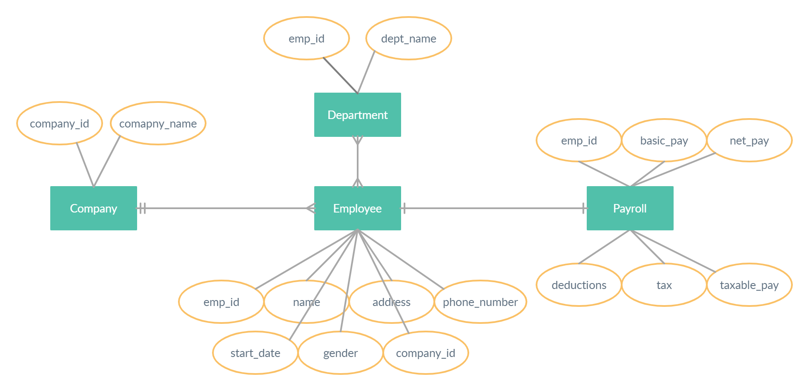

# employee-payroll-service-sql
## UC1_CreateEmpPayrollServiceDB
```
CREATE DATABASE payroll_service;
SHOW DATABASE;
USE payroll_service;
```
## UC2_CreateEmployeePayrollTable
```
CREATE TABLE employee_payroll (
id          INT unsigned NOT NULL AUTO_INCREMENT,
name        VARCHAR(150) NOT NULL,
salary      DOUBLE NOT NULL,
start_date  DATE NOT NULL
PRIMARY KEY (id)
);
```
## UC3_AddEmpPayrollData
```
INSERT INTO employee_payroll (name, salary, start_date) VALUES
   ('Vishal', 1500000.00, '2018-02-06'),
   ('John', 2500000.00, '2016-10-12'),
   ('Asifa', 1800000.00, '2019-10-10');
```
## UC4_RetrieveAllData
```SELECT * FROM employee_payroll;```
## UC5_RetrieveSpecificData
#### Retrieve salary using name
```
SELECT salary FROM employee_payroll 
   WHERE name = 'John';
```
#### Retrieve employee name using start date
```
SELECT name FROM employee_payroll
   WHERE start_date BETWEEN
   CAST('2018-01-01' AS DATE) AND DATE(NOW());
```
## UC6_AbilityToAddGender
```
ALTER TABLE employee_payroll ADD gender CHAR(1) AFTER name;

UPDATE employee_payroll set gender ='M'
   where name = 'Vishal' or name = 'John';
UPDATE employee_payroll set gender ='F'
   where name = 'Asifa';
```
## UC7_Find_Sum_Avg_Count
#### Total salary of all the female employees
```
SELECT SUM(salary) FROM employee_payroll
WHERE gender = 'F' GROUP BY gender;
```
#### Average salary of male employees
```
SELECT AVG(salary) FROM employee_payroll
WHERE gender = 'M' GROUP BY gender;
```
#### Max and Min salary
```
SELECT MIN(salary) FROM employee_payroll;
```
```
SELECT MAX(salary) FROM employee_payroll;
```
#### Count of employee numbers and based on their genders
```
SELECT COUNT(id) FROM employee_payroll;
```
```
SELECT COUNT(id) FROM employee_payroll WHERE gender = 'M';
```
## UC8_Add_PhNo_Address_Dept
```
ALTER TABLE employee_payroll ADD phone_number VARCHAR(10) AFTER name;
ALTER TABLE employee_payroll ADD address VARCHAR(200) AFTER name;
ALTER TABLE employee_payroll ADD department VARCHAR(20) NOT NULL AFTER phone_number;
```
## UC9_Add_PayrollColoumns
```
ALTER TABLE employee_payroll ADD net_pay DOUBLE NOT NULL AFTER basic_pay;
ALTER TABLE employee_payroll ADD tax DOUBLE NOT NULL AFTER basic_pay;
ALTER TABLE employee_payroll ADD taxable_pay DOUBLE NOT NULL AFTER basic_pay;
ALTER TABLE employee_payroll ADD deductions DOUBLE NOT NULL AFTER basic_pay;
```
## UC10_ERDiagram
```
INSERT INTO employee_payroll(name,department,gender,basic_pay,deductions,taxable_pay,tax,net_pay,start_date) VALUES
('Terisa','Sales','F',3000000,0,0,0,0,'2019-11-13'),
('Terisa','Marketing','F',3000000,1000000,2000000,500000,1500000,'2019-11-13');
```
#### ER Diagram

## UC11_Implement_ERDiagram
#### Create employee table and insert data
```
CREATE TABLE employee (
   emp_id INT unsigned NOT NULL,
   name VARCHAR(50) NOT NULL,
   address VARCHAR(200),
   phone_number VARCHAR(10),
   gender CHAR(1),
   start_date DATE NOT NULL,
   PRIMARY KEY (emp_id)
);
```
```
INSERT INTO employee (emp_id,name,gender,start_date) VALUES
   (1001,'Vishal','M','2018-02-06'),
   (1002,'Asifa','F','2019-10-10'),
   (1003,'John','M','2016-10-12'),
   (1004,'Terisa','F','2018-11-13');
```
#### Create department table and insert data
```  
CREATE TABLE department (
   emp_id INT unsigned NOT NULL,
   dept_name VARCHAR(20) NOT NULL,
   FOREIGN KEY (emp_id) REFERENCES employee(emp_id) 
);
```
```
INSERT INTO department (emp_id,dept_name) VALUES
   (1001,'Consultancy'),
   (1002,'Finance'),
   (1003,'Consultancy'),
   (1004,'Sales'),
   (1004,'Marketing');
```
#### Create payroll table and insert data
```
CREATE TABLE payroll (
   emp_id INT unsigned NOT NULL,
   basic_pay DOUBLE NOT NULL,
   deductions DOUBLE NOT NULL,
   taxable_pay DOUBLE NOT NULL,
   tax DOUBLE NOT NULL,
   net_pay DOUBLE NOT NULL,
   PRIMARY KEY (emp_id),
   FOREIGN KEY (emp_id) REFERENCES employee(emp_id) 
);
```
```
INSERT INTO payroll (emp_id,basic_pay,deductions,taxable_pay,tax,net_pay) VALUES
   (1001,900000,200000,700000,70000,630000),
   (1002,800000,200000,600000,60000,540000),
   (1003,900000,200000,700000,70000,630000),
   (1004,1200000,300000,900000,100000,800000);
```
#### Create company table and insert data
```
CREATE TABLE company (
   company_id INT unsigned NOT NULL,
   company_name VARCHAR(30) NOT NULL,
   PRIMARY KEY (company_id)
);
```
```
INSERT INTO company (company_id, company_name) VALUES
   (501,'BridgeLabz'),
   (502,'Capgemini');
```
#### Add company_id to the employee table
```UPDATE employee SET company_id=501;```
#### Assign company_id as the foreign key from company table
```ALTER TABLE employee ADD FOREIGN KEY (company_id) REFERENCES company(company_id);```